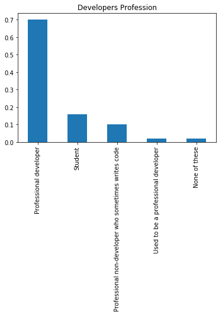
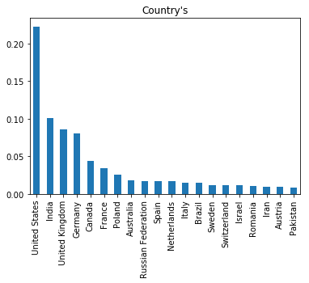
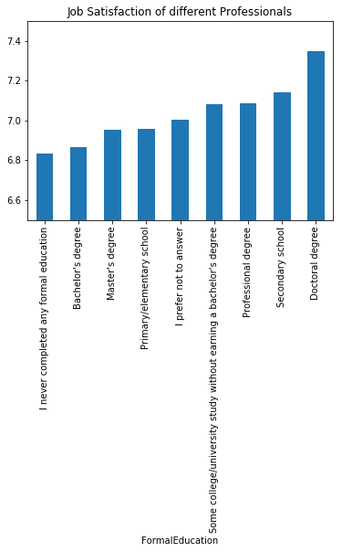
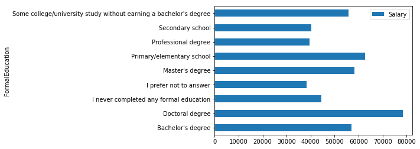
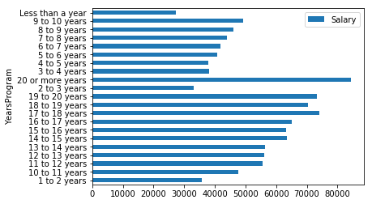

# Stack OverFlow Developers Survey, 2017

Analysing the Developers survey 2017 data from Stack Overflow. This dataset gives an insight about the suggestions given by working professionals in the tech industry to their cousins about how to storm start their careers in tech industry as they belongs to non tech background.

## Objectives
- What was the developers Profession and formal education ?
- which Countries data was collected from during survey?
- How satisfied were the working professionals?
- How education may influence the salary?
- The rate of increase in salary with the years of experience

## Summary
## 1.What was the developers Profession and formal education?

- Professional developer                                  36131
- Student                                                  8224
- Professional non-developer who sometimes writes code     5140
- Used to be a professional developer                       983
- None of these                                             914

## 2. which Countries data was collected from during survey?

- United States         11455
- India                  5197
- United Kingdom         4395
- Germany                4143
- Canada                 2233
- France                 1740
- Poland                 1290
- Australia               913
- Russian Federation      873
- Spain                   864
- Netherlands             855
- Italy                   781
- Brazil                  777
- Sweden                  611
- Switzerland             595
- Israel                  575
- Romania                 561
- Iran                    507
- Austria                 477
- Pakistan                454

## 3. How satisfied were the working professionals?

- I never completed any formal education                               6.833333
- Bachelor's degree                                                    6.866363
- Master's degree                                                      6.953151
- Primary/elementary school                                            6.956897
- I prefer not to answer                                               7.005682
- Some college/university study without earning a bachelor's degree    7.081334
- Professional degree                                                  7.087459
- Secondary school                                                     7.143082
- Doctoral degree                                                      7.348857

## 4. How education may influence the salary?

-	Bachelor's degree	56914.358553
-	Doctoral degree	78527.933053
-	I never completed any formal education	44430.660621
-	I prefer not to answer	38284.836141
-	Master's degree	58250.838766
-	Primary/elementary school	62677.337356
-	Professional degree	39503.658863
-	Secondary school	40395.148419
-	Some college/university study without earning ...	55912.810459

## 5. Rate of increase of salary with years of experience ?

-	1 to 2 years	35625.727186
-	10 to 11 years	47723.234743
-	11 to 12 years	55617.139567
-	12 to 13 years	56225.344348
-	13 to 14 years	56449.998540
-	14 to 15 years	63527.583591
-	15 to 16 years	63149.645686
-	16 to 17 years	65109.493505
-	17 to 18 years	74186.535157
-	18 to 19 years	70397.724801
-	19 to 20 years	73228.867280
-	2 to 3 years	33140.925726
-	20 or more years	84323.386020
-	3 to 4 years	38169.784702
-	4 to 5 years	37945.601195
-	5 to 6 years	40812.610874
-	6 to 7 years	41932.453974
-	7 to 8 years	43901.717442
-	8 to 9 years	46125.956771
- 9 to 10 years	49300.837745
-	Less than a year	27349.336436
## View a detailed analysis report on Blooger

## Requirements
`pandas`, `matplotlib`, `jupyter-notebook` (if running locally)

## Files in the repo
- `Write-a-Data-Science-Blog-Post.ipynb` - Analysis
- `survey_results_public.csv` - Developers Survey Result Data
- `survey_results_schema.csv` `reviews.csv` - Developers Survey Result Schema

## License
Copyright (C) 2007 Free Software Foundation, Inc. <https://fsf.org/>
 Everyone is permitted to copy and distribute verbatim copies
 of this license document, but changing it is not allowed.
 
**Copyright (c) 2021 V19Msheikh**

This project is licensed under  GNU GENERAL PUBLIC LICENSE - see the LICENSE file for details

## Acknowledgements
## Data Source
- https://insights.stackoverflow.com/survey/
